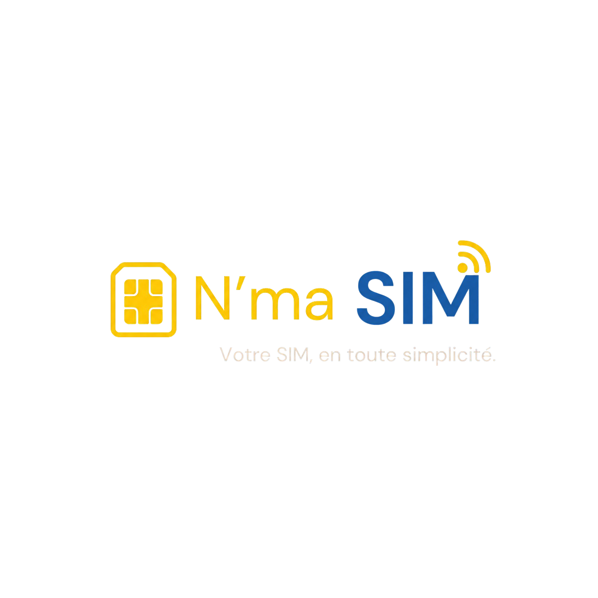

# 📱 N'ma SIM Kiosk Platform

 <!-- Assure-toi que ce chemin correspond à ton logo -->

N'ma SIM est une plateforme innovante de gestion de bornes interactives développée pour simplifier et sécuriser les opérations liées aux cartes SIM. La plateforme intègre des technologies avancées de vérification d'identité (KYC) par Intelligence Artificielle (OCR & Reconnaissance faciale) et offre une expérience utilisateur fluide, bilingue et hautement sécurisée.

---

## 🚀 Fonctionnalités Principales

### 1. 🛡️ Vérification d'Identité Avancée (KYC)
- **Scan de Documents** : Prise en charge des CNI, Passeports et Cartes d'électeur via la caméra de la borne ou par import de fichier.
- **Extraction Automatique (OCR)** : Extraction intelligente des données des pièces d'identité grâce à l'IA (intégré avec l'API Groq).
- **Vérification Biométrique** : Capture de selfie en temps réel et comparaison faciale pour s'assurer que l'utilisateur correspond bien au document présenté.
- **Logique de Profiling** : Gestion différenciée entre les profils "Résident" et "Étranger" (ex: limitation au passeport pour les étrangers).

### 2. 🔄 Modules Opérationnels
- **Nouvelle SIM** : Parcours complet d'enrôlement avec KYC, choix du numéro et paiement.
- **Réactivation** : Parcours sécurisé pour récupérer une puce perdue ou désactivée, avec vérification des numéros fréquemment appelés.
- **Recharge** : Achat de crédit rapide avec saisie intuitive du montant.
- **Vérification de Profil** : Permet à l'utilisateur de consulter l'état de son compte et les numéros actifs liés à sa pièce d'identité.

### 3. 💳 Intégration des Paiements
- **Orange Money** : Paiement mobile rapide avec validation par code OTP.
- **Carte Bancaire (VISA)** : Saisie manuelle sécurisée ou scan de la carte par la caméra.

### 4. 🌍 Accessibilité et UX
- **Bilinguisme Intégral** : Interface entièrement traduisible à la volée (Français / Anglais).
- **Design Adaptatif** : Interface optimisée pour une utilisation tactile sur borne (composants larges, boutons clairs, feedback visuel et haptique simulé).
- **Reçus Numériques** : Génération de reçus avec code QR et option d'impression directe.

---

## 🛠️ Stack Technique

Le projet est divisé en plusieurs couches pour garantir scalabilité et séparation des préoccupations :

* **Frontend** : [Next.js](https://nextjs.org/) (React) + [Tailwind CSS](https://tailwindcss.com/) pour une interface réactive et moderne.
* **Backend Kiosk API** : Node.js (probablement Express/NestJS) gérant la logique métier, les paiements et le stockage local des sessions.
* **Microservice KYC (`nma_kyc_api`)** : Service dédié au traitement des images, à l'OCR et à la reconnaissance faciale.
* **Intégrations IA** : Utilisation de modèles d'IA pour le traitement des données (ex: Groq).

---

## 📂 Structure du Projet

```text
nma-sim-dev/
├── frontend/             # Application Next.js pour l'interface de la borne
│   ├── src/app/borne/    # Parcours client (Accueil, Nouvelle SIM, Réactivation, etc.)
│   ├── src/components/   # Composants UI réutilisables (Cards, Buttons, CameraCapture...)
│   └── src/lib/          # Utilitaires (kyc.client.ts, stockage, etc.)
├── backend/              # Serveur principal (logique métier)
├── nma_kyc_api/          # Microservice d'analyse d'images et d'IA
├── .env                  # Variables d'environnement sécurisées (API Keys, DB URIs)
└── .gitignore            # Fichiers ignorés par Git (secrets, node_modules, etc.)
